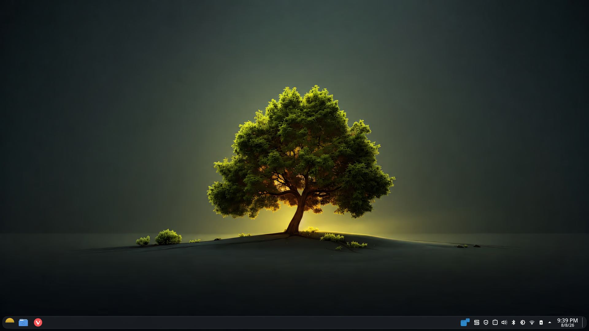

# DAWN _Linux_
DAWN is a lightweight Linux distribution designed to deliver a quiet, distraction-free environment—inspired by the peace of early morning clarity. It handles security, optimization, and system maintenance entirely in the background, allowing you to focus on your work without invasive telemetry, false-alarm security bloat, or OS friction.

## Screenshot

## Key Features

| Category | Highlights |
| --- | --- |
| **Workspace & Search** | Telemetry-free collaborative suite with built-in, local dictation and grammar checks. Universal deep search indexes text, PDFs, audio, and video files for instant access. |
| **System-Level Audio** | Native noise cancellation active at the OS level, stripping out background traffic, pet noise, and static from your microphone feed across all applications. |
| **Gaming & Media** | Tracker-free video playback paired with out-of-the-box, zero-setup Steam and Lutris gaming integration. |
| **Mobile Integration** | Deep KDE Connect sync enabling unified clipboard copy/paste, rapid file transfers, phone-as-trackpad functionality, and side-by-side Android app execution. |
| **Storage & Performance** | Transparent ZSTD filesystem compression saves disk space without performance penalties. Optimized to run fluidly on hardware dating back to 2016. |
| **Unobtrusive Updates** | Fast, lightweight weekly updates that install silently in the background with zero forced reboots. |

## Core Philosophy

* **Security as Clean Air:** Protection is woven directly into everyday productivity features rather than gating workflows behind obstructive security prompts. DAWN prioritizes practical resilience over chasing automated scanner scores.
* **Hardware Sustainability:** Engineered with low resource overhead to keep capable hardware out of landfills and support the right to repair.
* **Telemetry-Free Freedom:** Zero data harvesting, zero ads, and total independence from corporate surveillance.

## System Foundations
DAWN is crafted using the best components of the open-source ecosystem:

* **Base Infrastructure:** Arch Linux / Manjaro base for rolling stability and modern package availability.
* **Desktop Environment:** Highly refined KDE Plasma stack configured for a distraction-free workflow.
* **Core Storage:** Btrfs/ZFS with automatic ZSTD compression enabled.

## Availability & Roadmap
DAWN is currently in private preview while system components are refined for daily driver reliability.
* **Target Public Release:** **September 17, 2026** *(Marking the 35th anniversary of the initial Linux source code release).*

## Contributing
See [CONTRIBUTING.md](CONTRIBUTING.md).

## High-Level Architecture
See [architecture.md](architecture.md).

## Module Map
| Module                                              | Purpose                                                      |
| --------------------------------------------------- | ------------------------------------------------------------ |
| [`boot`](modules/boot/boot.md)                      | Bootloader and initial kernel parameters.                    |
| [`desktops`](modules/desktops/desktops.md)          | GUI environments and workspace setups.                       |
| [`environment`](modules/environment/environment.md) | Global environment variables, apps and shell configurations. |
| [`hardware`](modules/hardware/hardware.md)          | Platform-specific machine hardware definitions.              |
| [`hosts`](modules/hosts/hosts.md)                   | The ultimate definition of specific server/client instances. |
| [`networking`](modules/networking/networking.md)    | Network interfaces, WiFi, and VPN configurations.            |
| [`programs`](modules/programs/programs.md)          | General software package management and configuration.       |
| [`services`](modules/services/services.md)          | Daemon processes and background services.                    |
| [`users`](modules/users/users.md)                   | User accounts, groups, and sudoer permissions.               |
